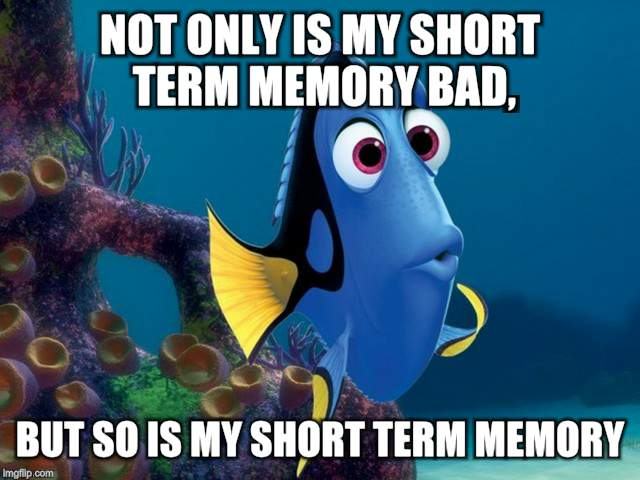
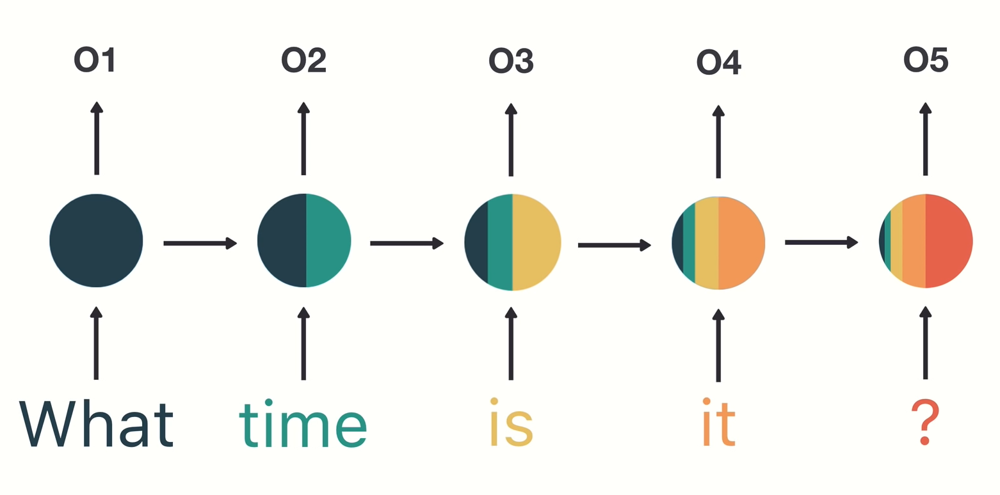

# Потребата од LSTM

## Проблемот кај RNN: краткотрајна меморија

RNN 'страдаат' од проблем на краткотрајна меморија. 

Ако изградиме некоја невронска мрежа базирана на некој едноставен пример како на следнава слика:

Проблемот со кој се соочуваат RNN е пренесувањето на информација од првичните временски чекори до чекорите кои се понатаму во времето. Можеме да забележиме како информацијата која се пренесува од почетните чекори, односно во случајов зборовите 'What' и 'time', кога ќе се дојде до внесот '?' е веќе доста мала(илустрирано е како се намалува преку делот од кругчето кое е обоено со таа боја). Што значи дека при процесирање на текст со цел предвидување, внесовите на текстот од почетокот ќе имаат помало значење од внесовите на текстот од понатамошните фази. Тука лежи проблемот на 'Vanishing gradient'. Тој се состои од фактот дека поради овој проблем, RNN не ги учат подолготрајните зависности низ временските чекори. Вредноста на gradient-от се намалува при процесот на backpropagation, што доведува до многу мало, незначително учење, што доведува до можноста, од примерот, влeзовите 'What' и 'time' да не бидат користени при крајните обиди за предвидување. Тоа би ја оставило мрежата на крај да предвидува со влезовите 'is' и 'it' кога ќе се дојде до последниот чекор што е тешко да се направи дури и за луѓето.

## LSTM како решение

Long Short Term Memory е тип на модел на длабоко учење кој бил креиран како решение за овој проблем на краткотрајното учење на RNN. Тоа е направено со помош на внатрешни механизми кои се нарекуваат порти(gates) и го регулираат протокот на информација. Решението не е да се чува целата информација, што би било непотребно, но да се филтрира која информација е потребна да се пренесе при подолга низа на секвенци за да се направи некое предвидување. Споредено со проблемот од сликата од погоре, со помош на LSTM нема да би се пренеле само последните неколку зборови како најважни при предвидувањето, туку најважните, а количински информацијата пренесена би останала слична. Барем повеќето од најважните модерни и важни истражувања базирани на RNN се постигнати со помош на овие модели на мрежи. Се користат доста во препознавање на говор, синтеза на говор, генерација(предвидување) на текст, предвидување на титлови на видео и сл.

## Пример преку интуиција

Да кажеме дека прегледуваме online reviews за да се одлучиме дали сакаме да купиме некој продукт или не. Прво нешто што бараме се најистакнатите коментари за да видиме дали некој пред нас што веќе го купил истото имал некое добро или лошо мислење за тоа. 

Го гледаме целото review, но паметиме само клучни зборови од истото. Во нашето паметење остануваат клучни зборови како 'amazing' и 'perfectly balanced breakfast', не работи како сврзниците или другите составни зборови од реченицата. Доколку не праша некој за мислење, или доколку утре тргнеме да си го купиме тоа за кое сме гледале reviews, намерата која ќе ја пренесеме ќе е базирана на тоа. Останатото веќе ни избледело од сеќавање, бар мене, во овие неколку редови откако го прочитав review-то, додека стигнав до ова.

Тоа е и токму тоа што LSTM го прави. Памети и зачувува при пренос само поважни информации кои се потребни за предвидување, а ги заборава останатите. Во овој случај сè што ќе запаметиме е дека продуктот бил добар. Како што кажав кажав и на почетокот, целта на областа на длабоко учење се типови на модели кои работат слично на функционирањето на човечкиот мозок, што значи дека, во случајот со LSTM, целта е постигната.