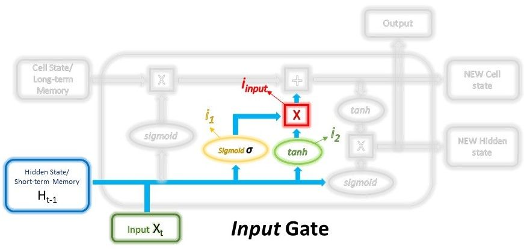
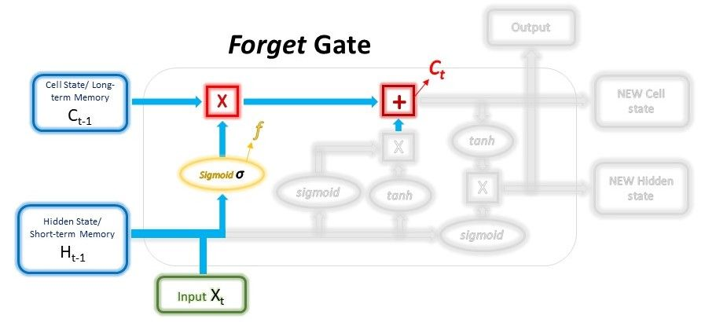

# Повеќе за LSTM

LSTM имаат сличен flow како и RNN. Процесираат податоци и пренесуваат информација како што пропагираат нанапред. Разликата од RNN е во однос на операциите кои се извршуваат во ќелиите на LSTM. 

Ова се операциите кои овозможуваат на LSTM да чува или да заборава информации. 

## Концептот на LSTM

Главниот концепт на LSTM мрежите е состојбата на ќелијата и портите кои се содржат во учеството на нејзиното регулирање. Таа пренесува информации понатаму низ веригата на секвенци кои се случуваат. На некој начин таа е 'меморија' на мрежата. Таа пренесува информации не само од последната секвенца, туку и од претходните временски чекори кои биле сметани за потребни, со тоа спротиставувајќи му се на проблемот со краткорајна меморија кои го имаат RNN. Низ целото 'патување' на неа се додаваат или одземаат информации преку портите кои го одлучуваат тоа, што ќе дозволат да остане, што ќе се 'заборави'. Портите, при процесот на тоа одлучување, дејствуваат како засебни невронски мрежи.

## Сигмоиди

Портите содржат сигмоидни активации. Сигмоидна активација е слична на концептот на tanh активацијата која беше пресудна кај RNN. Разликата е што влезните вредности се нормализираат во рангот помеѓу 0 и 1. Ова овозможува да се зачува или да се 'заборави' информација, бидејќи множењето со вредности блиски или еднакви до 1 помага да се зачува таа информација, додека множењето со вредности кои се стремат кон 0 предизвикува вредноста да ја снема, односно да се заборави. Така LSTM мрежите одлучуваат кои податоци се важни за да се зачуваат, а кои не и може да се 'заборават'.

## Порти кај LSTM

Секоја LSTM мрежа има три различни порти кои го регулираат протокот на информации:

- **Input порта**
  
  Нејзината цел е избор кои(и колку) од **новите информации** ќе бидат зачувани во **долготрајната меморија**. Во неа влегуваат претходниот hidden state и моменталниот влез кои се предаваат на сигмоидна активација. Така се одлучува кои вредности ќе бидат пренесени преку нивна трансформација во 0(ќе биде заборавена) или 1(ќе биде пренесена). Истиот процес се случува и предавање во tanh функција, која има и своја сигмоидна активација која одлучува колкав дел од излезот од неа ќе биде зачуван преку операцијата на множење која се извршува.
  
  
  
  Математички ова е постигнато со користење на два слоеви:
  
  - Првиот може да се претстави со формула:
  
  $$
  i_1=σ(W_{i_1}⋅(H_{t−1}, x_t)+bias_{i_1})
  $$
  
          Како слојот е трениран со помош на *back-propagation*, тежините во сигмоидната функција ќе бидат обновени така што истиот ќе научи да ги пропушта само корисните работи да поминат понатаму, притоа отфрлајќи ги помалку корисните својства.
  
  - Вториот може да се претстави исто така со формула:
  
  $$
  i_2=tanh(W{i_2}⋅(H_{t−1}, x_t)+bias_{i_2})
  $$
  
          Како што објаснивме, тука е делот со кој се врши регулација на мрежата.
  
  Излезот од нивната комбинација е влезот во самата Input порта, односно информацијата која ќе биде зачувана во меморијата:
  
  $$
  i_{input}=i_1∗i_2
  $$

- **Forget порта**
  
  Forget портата служи како **регулација** кои информации од долготрајната меморија ќе бидат зачувани, а кои отфрлени. Се дефинира преку состојбата од претходната ќелија, на која преку множење со forget векторот се пресметува дали и колку од таа информација ќе остане, како и собирањето на излез вредноста на tanh функција со forget векторот применет на неа, каде се пресметува дали и колку од новата информација ќе биде зачувана. Преку собирање на двете компоненти се добива новата состојба на ќелијата(долготрајната меморија).
  
  
  
  Математички ќе го претставиме тоа на следниот начин:
  
  $$
  f=σ(W_{forget}⋅(H_{t−1}, x_t)+bias_{forget})
  $$
  
  Функција слична на слојот од Input портата, со тоа што, во овој случај, тежините се различни. 
  
  $$
  C_t=C_{t−1}∗f+i_{input}
  $$
  
  Излезот од претходната функција(forget векторот) се множи со долготрајната меморија и избира кои делови од истата ќе бидат зачувани. На тој резултат се додава излезот од Input портата кој го објаснивме, односно новата информација која што е одлучено да се додаде кон долготрајната меморија. Резултатот од ова се предава понатаму на Output портата.

- **Output порта**
  
  Ја одлучува следната hidden state преку предавање на новата состојба на ќелијата во tanh функција и нејзино множење со forget векторот. Врз двете влезни компоненти потоа се врши множење. Резултатот, следната hidden state, потоа се предава понатаму за користење како информација за претходните влезови при натамошно предвидување. 
  
  
  
  Математички претставено преку формули изгледа следно:
  
  $$
  O_1=σ(W_{output_1}⋅(H_{t−1}, x_t)+bias_{output_1})
  $$
  
  $$
  O_2=tanh(W_{output_2}⋅C_t+bias_{output_2})
  $$
  
  $$
  H_t,O_t=O_1∗O_2
  $$
  
  Излезите, односно hidden state-от и долготрајната меморија(состојбата на ќелијата) се предадени кон следната итерација на процесот. Излезот од конкретната итерација може да се добие преку hidden state-от. 

## Python псевдо код за LSTM

Кодот опишан на кратко би бил for циклус и неколку функциски операции. кои враќаат следни состојба на ќелија и hidden state. Преку комбинирање на тие неколку функциски операции LSTM мрежата бира кои информации се од важност за да се пренесат или да се 'заборават' при процесирањето на секвенците.